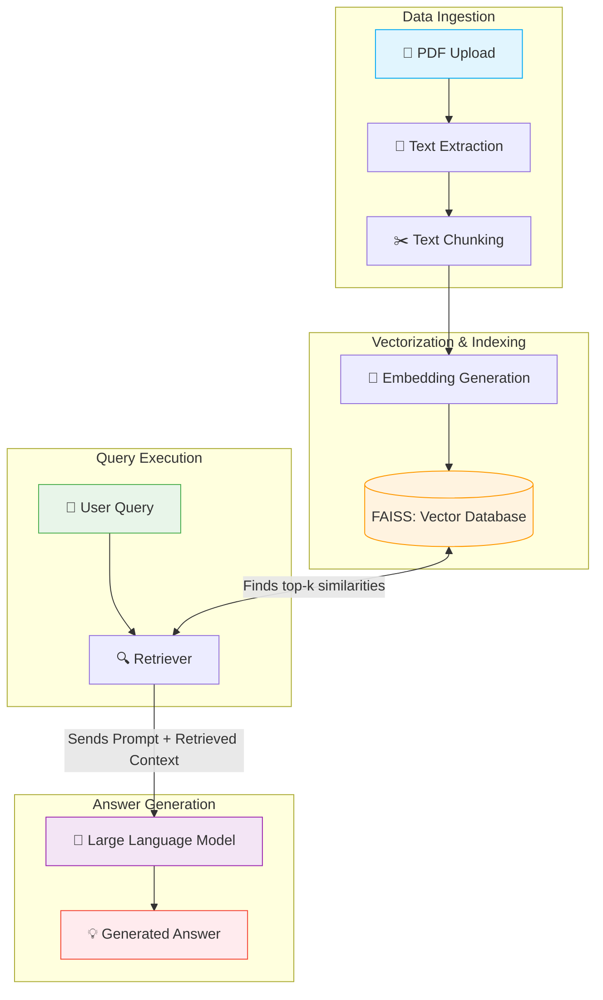

# System Architecture: Retrieval-Augmented Generation (RAG) Pipeline

This document explains the end-to-end architecture of the GenAI Research Paper Assistant. The system leverages Retrieval-Augmented Generation (RAG) to ensure that generated answers are strictly grounded in the academic literature provided by the user, rather than the internal knowledge of the Pre-Trained Language Model.

## Architecture Pipeline Diagram

The following flowchart illustrates the complete journey of a document being ingested, processed, and ultimately used to generate a highly accurate, context-aware answer to a user query.

---

## Detailed Workflow Explanation

The Retrieval-Augmented Generation (RAG) pipeline operates through a systematic, multi-step process designed to ground generated answers in the provided academic documents:

1. **Document Processing (Data Ingestion):** The pipeline begins by extracting raw text from uploaded academic research papers (PDFs). Because Large Language Models process limited context limits, the extracted text is divided into smaller, manageable segments known as "chunks." These chunks are created with partial overlap to preserve semantic continuity across boundaries.
2. **Vectorization (Embedding):** Each text chunk is mathematically converted into a numerical format, known as an embedding, using a pre-trained embedding model.
3. **Storage and Indexing:** These embeddings, alongside the original text they represent, are stored in a specialized vector database optimized for rapid similarity search.
4. **Information Retrieval:** When a user poses a query, the question is converted into an embedding using the same model. The system queries the vector database to find the text chunks whose embeddings are mathematically most similar to the query's embedding.
5. **Answer Generation:** Finally, the retrieved text chunks are provided alongside the user's original query as context to a Large Language Model (LLM). The LLM processes this context to generate a precise, grounded answer based solely on the provided academic literature, thereby minimizing the risk of generating inaccurate information.

---

## Component Roles in the RAG Pipeline

### Role of Embeddings
Embeddings serve as the fundamental mathematical representation of textual data within the pipeline. They translate human-readable text into high-dimensional vectors (arrays of numbers) such that texts with semantic similarity are positioned close to one another in the vector space. This spatial representation allows the system to comprehend the underlying meaning and context of the text, successfully matching user queries with relevant information even if different vocabulary is utilized.

### Role of the FAISS Vector Database
FAISS (Facebook AI Similarity Search) functions as the specialized storage and indexing engine for the architecture. Unlike traditional relational databases that rely on exact keyword matching, FAISS enables highly efficient and rapid similarity searches across large sets of high-dimensional vectors. It indexes the embeddings of the document chunks, allowing the system to instantly identify and retrieve the nearest neighbors to a given query vector.

### Role of the Retriever
The retriever acts as the bridge connecting the user's query to the stored knowledge base. Its primary function is to compute the embedding for the incoming question and to direct the FAISS vector database to execute a similarity search. By calculating the mathematical proximity—typically using cosine similarity—between the query vector and the stored document chunk vectors, the retriever extracts the most highly relevant pieces of text necessary to construct a well-informed answer.

### Role of the Large Language Model (LLM)
The Large Language Model (LLM) serves as the final generative synthesis engine of the RAG pipeline. Instead of relying purely on its pre-existing internal knowledge, the LLM is supplied with a strict prompt structure containing both the user's query and the explicitly retrieved context. The role of the LLM is to comprehend this retrieved context and output a coherent, natural-language response. By operating under these explicit contextual constraints, the LLM provides verifiable, factually grounded text highly suitable for academic inquiry.
