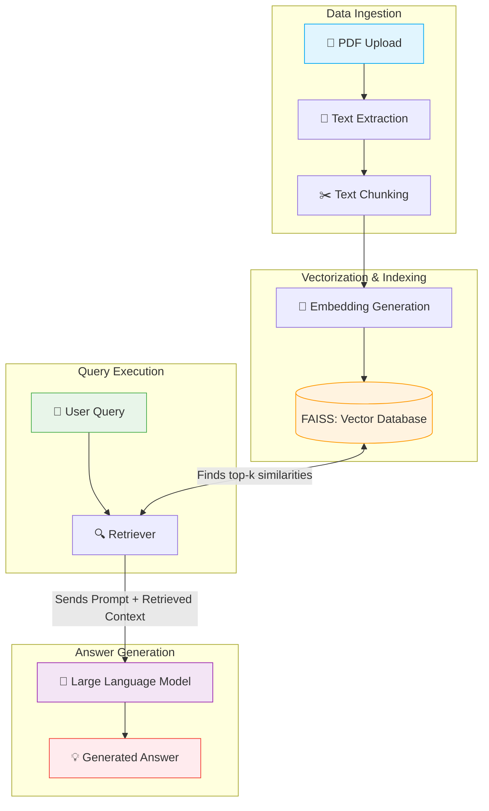

# System Architecture: Retrieval-Augmented Generation (RAG) Pipeline

This document explains the end-to-end architecture of the GenAI Research Paper Assistant. The system leverages Retrieval-Augmented Generation (RAG) to ensure that generated answers are strictly grounded in the academic literature provided by the user, rather than the internal knowledge of the Pre-Trained Language Model.

## Architecture Pipeline Diagram

The following flowchart illustrates the complete journey of a document being ingested, processed, and ultimately used to generate a highly accurate, context-aware answer to a user query.

---

## Pipeline Components Breakdown

### 1. Data Ingestion Phase
- **📄 PDF Upload:** The user uploads one or more academic research papers in PDF format.
- **📝 Text Extraction:** The system uses robust parsing libraries (like `PyMuPDF` or Langchain's document loaders) to strip formatting, images, and tables, extracting only the clean, raw text from the research paper.
- **✂️ Text Chunking:** Because dense academic texts are extremely long and LLMs have strict context window limits, the extracted text is systematically split into smaller, overlapping chunks (e.g., 500 tokens each with a 50-token overlap). This ensures sentences aren't cut off abruptly and maintains semantic continuity.

### 2. Vectorization & Indexing Phase
- **🧠 Embedding Generation:** Each of these text chunks is passed through a pre-trained dense embedding model (such as `sentence-transformers/all-MiniLM-L6-v2`). This model mathematically translates the English text into high-dimensional numerical vectors, capturing the deep semantic meaning of the paragraph.
- **🗃️ Vector Database (FAISS):** These generated vectors (along with their original text metadata) are stored in **FAISS** (Facebook AI Similarity Search). FAISS is an extremely fast library optimized for quickly searching through millions of dense vectors to find nearest neighbors.

### 3. Query Execution Phase
- **👤 User Query:** The user inputs a specific question about the uploaded papers (e.g., *"What was the dataset used to train the model?"*).
- **🔍 Retriever:** The system takes the user's string query and runs it through the exact same Embedding Generation model from Phase 2. The Retriever then asks FAISS to perform a mathematical cosine similarity search, comparing the vector of the User Query against all the chunk vectors in the database. FAISS rapidly returns the $k$ most closely related text chunks.

### 4. Answer Generation Phase
- **🤖 Large Language Model (LLM):** The system takes the original user query and concatenates it with the top-$k$ retrieved text chunks into a structured prompt template.
  > *"Using only the following retrieved context, answer the user query... Context: [Retrieved Chunks] ... Query: [User Question]"*
- **💡 Generated Answer:** The generative model reads the provided context and synthesizes a fluent, natural language response. Crucially, the model is instructed to answer *only* using the information provided, completely neutralizing external hallucinations and delivering a fact-checked, citation-ready response.
